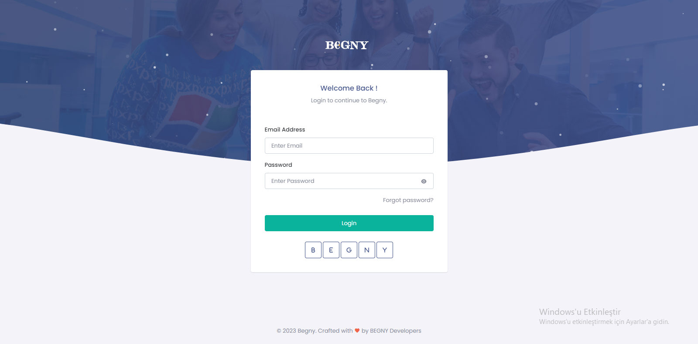

# HumanResourceProject

<h4>Website working video</h4>

This project introduces a Human Resources Management System developed using the Model-View-Controller (MVC) architecture and incorporating ASP.NET Core 6, Identity, and Entity Framework Core technologies. This system is designed to facilitate and optimize the management of human resources in businesses.
## Features

- User Management: Users can register and log in. The system uses ASP.NET Identity for authentication and authorization processes.

- Admin Panel: Administrators can log in with special privileges. The admin panel is used for managing companies and company administrators. Operations such as adding new companies, editing existing data, and tracking processes can be performed here.

- Companies and Administrators: Company administrators can oversee company operations. Tasks such as personnel management, permissions, advances, and adding jobs are carried out here.

- Personnel Operations: Employees can perform operations such as leave requests, advance requests, and expense tracking. They can also keep track of their transaction history.
- Location and Weather Information: Real-time location information is obtained using RapidAPI with user permission. Weather information is provided based on the acquired location data.

- Exchange Rate Information: The project uses APIs to fetch the dollar exchange rate.

## Technologies Used

- Backend: ASP.NET Core 6 with C# was used.
- Database: A cloud database hosted on Azure was used.
- ORM (Object-Relational Mapping) Tool: Entity Framework Core was used.
- Frontend: HTML, CSS, and Bootstrap were used for the user interface.
